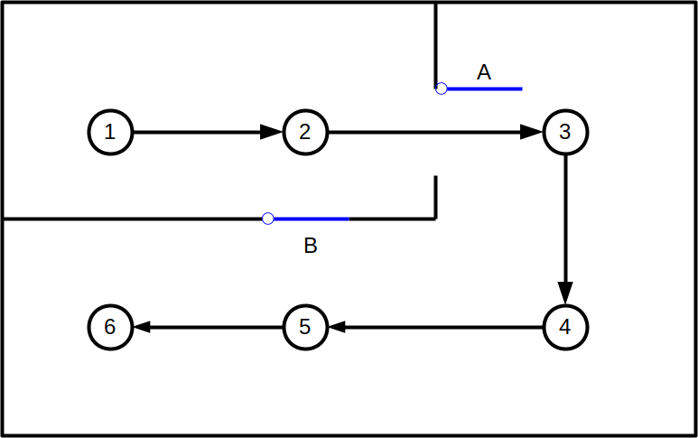
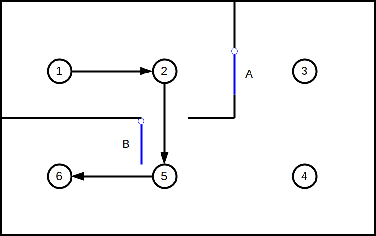

<!--
Copyright (c) 2021 Boston Dynamics, Inc.  All rights reserved.

Downloading, reproducing, distributing or otherwise using the SDK Software
is subject to the terms and conditions of the Boston Dynamics Software
Development Kit License (20191101-BDSDK-SL).
-->

# Directed Exploration

## What is Directed Exploration?

Directed Exploration is a feature that enables Spot to navigate robustly when the environment has changed.  When Spot's path is blocked by an unexpected obstacle, Directed Exploration allows Spot to use its sensors to find a clear path to a nearby waypoint, even if that waypoint is not connected to Spot's current waypoint in the GraphNav map.  This enables Spot to deal with environments where new obstacles may have been added, old obstacles may have been moved, and doors may have been opened or closed.

For example, suppose you record the Autowalk mission shown below, where Spot visits the waypoints 1 through 6 in order.  When you record the mission, door A is open and door B is closed.

Now, imagine someone closes door A and opens door B.  Without Directed Exploration, Spot would get stuck at closed door A when it tried to replay the mission.

Directed Exploration will see that Spot can travel from waypoint 2 to waypoint 5 through open door B, even though this door was closed when the mission was recorded.

After reaching waypoint 5, Spot will navigate to the final destination at waypoint 6.

## When is Directed Exploration invoked?

Directed Exploration is invoked as a last resort when all other attempts to find a path to the destination have failed.  Other strategies include attempting to plan a different route through the edges in the GraphNav map and attempting to follow alternate waypoints that are created next to the waypoints on the map.

Directed Exploration can succeed in some situations where these other strategies fail, because Directed Exploration frees Spot from the constaint of navigating along edges stored in the GraphNav map.  Directed Exploration allows Spot to use its sensors to determine whether it can reach nearby waypoints, even if those waypoints aren't connected to its current location in the GraphNav map.

## How to enable/disable Directed Exploration

Directed Exploration is enabled by default.

To disable Directed Exploration when replaying an Autowalk mission from the tablet, uncheck the box marked "Drive around large obstacles" on the mission upload screen.  This will disable both Directed Exploration and alternate waypoints, but it will still allow replanning alternate routes through the GraphNav map.

To disable Directed Exploration for a NavigateTo or NavigateRoute command issued through the SDK, set the disable_directed_exploration field of the corresponding TravelParams proto to true.

To disable Directed Exploration for a mission requested through the SDK, set the disable_directed_exploration field of the PlaySettings proto in the PlayMissionRequest to true.
