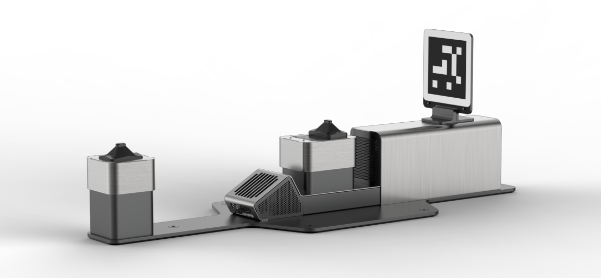

<!--
Copyright (c) 2021 Boston Dynamics, Inc.  All rights reserved.

Downloading, reproducing, distributing or otherwise using the SDK Software
is subject to the terms and conditions of the Boston Dynamics Software
Development Kit License (20191101-BDSDK-SL).
-->

# Docking

## Spot Dock

The Spot Dock (pictured below) is a docking station for the Spot Robot that has power and high speed ethernet connections to recharge and download data from the robot.

The tag on top of the robot is used by the robots vision system to locate the dock. It should be kept clean and unobstructed.

There are two indexing cones on the dock which help locate the robot connector. When Spot docks, they lower, revealing the connector. The rear tower is secured by an interlock preventing the electrical connector being exposed without a robot.

## Docking Service

The docking service provides an interface to control Spot and use a Spot Dock.

There are four RPCs to the docking service.

| RPC  | Description |
| ---- | ----------- |
| DockingCommand | Dock and Undock the robot |
| DockingCommandFeedback | Get feedback on running DockingCommands |
| GetDockingConfig | Get the robots docking configuration |
| GetDockingState | Get the current docking status of the robot |

## Typical Usage
### Docking the Robot
To dock the robot it should be powered on and standing near the dock so that the robot can detect it.
1. Issue a `DockingCommand`, with an end time long enough to complete the docking sequence (30 seconds is a recommended value). You will be provided a docking command ID in return.
2. Poll the robot with `DockingCommandFeedback` with the provided docking command ID to check on the status on the execution. It should report `STATUS_IN_PROGRESS` while executing then `STATUS_DOCKED` when finished.
3. Docking the robot automatically powers it off at the end.

You do not need to issue multiple `DockingComand` rpcs unless you explicitly want to issue a new docking command.

### Undocking the Robot
To undock the robot it should be sitting on the dock with the area in front of the dock unobstructed.
1. Power on the robot however you like, this is not the responsibility of the docking service for safety reasons.
2. Issue a `DockingCommand` with an end time, but this time set the `prep_pose_behavior=PREP_POSE_UNDOCK`. A `docking_station_id` is not required to undock.
2. The robot will stand up, and walk in front of the dock.
3. Poll the robot with `DockingCommandFeedback` with the provided docking command ID to check on the status on the execution. It should report `STATUS_IN_PROGRESS` while executing then `STATUS_AT_PREP_POSE` once undocking has finished.
4. The robot will remain standing waiting for its next command.

If the area in front of the robot isn't clear it's possible to manually undock the robot by simply powering it on, standing, and driving, just like you would if the robot wasn't docked. Under normal circumstances it's recommended to use the automatic undocking behavior.

### Docking Config
Issuing a `GetDockingConfig` command will return a list of dock IDs and their dock type. This can help determine what the robot will detect as a dock, and which type of dock.

### Docking State
Issuing a `GetDockingState` command will return the docked status of the robot independent of any `DockingCommand`. It will indicate if the robot is already docked, currently docking, or not docked.
If the robot is docked extra information about the dock ID, and charge status is provided.

