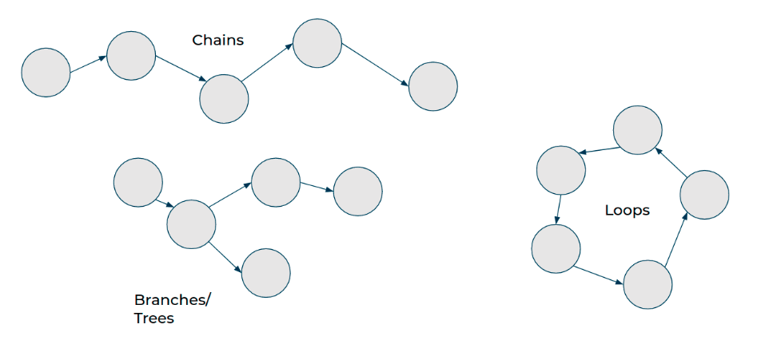
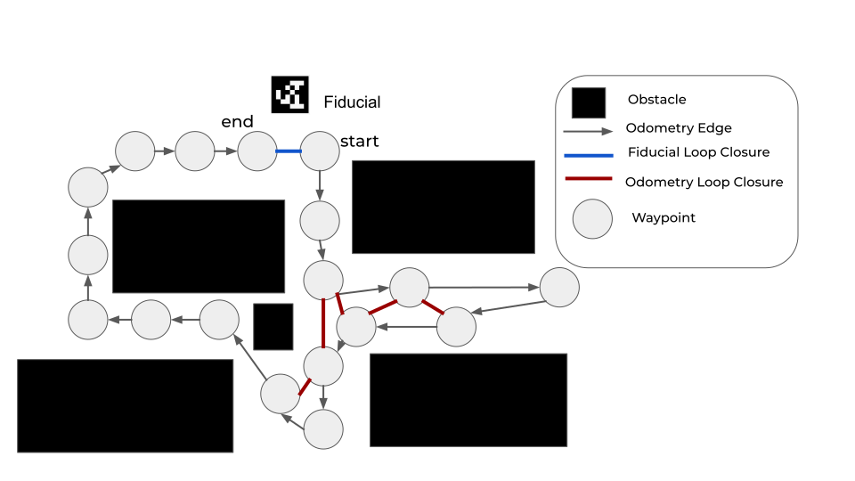
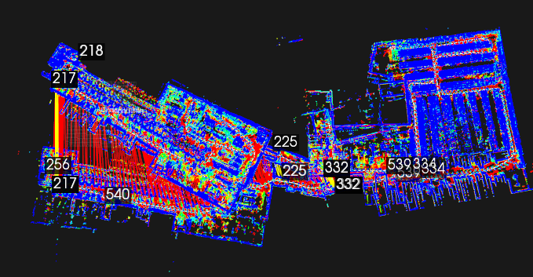
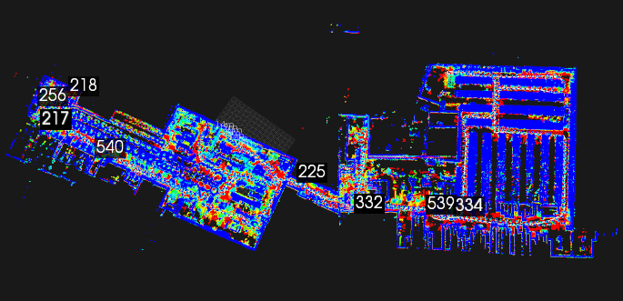
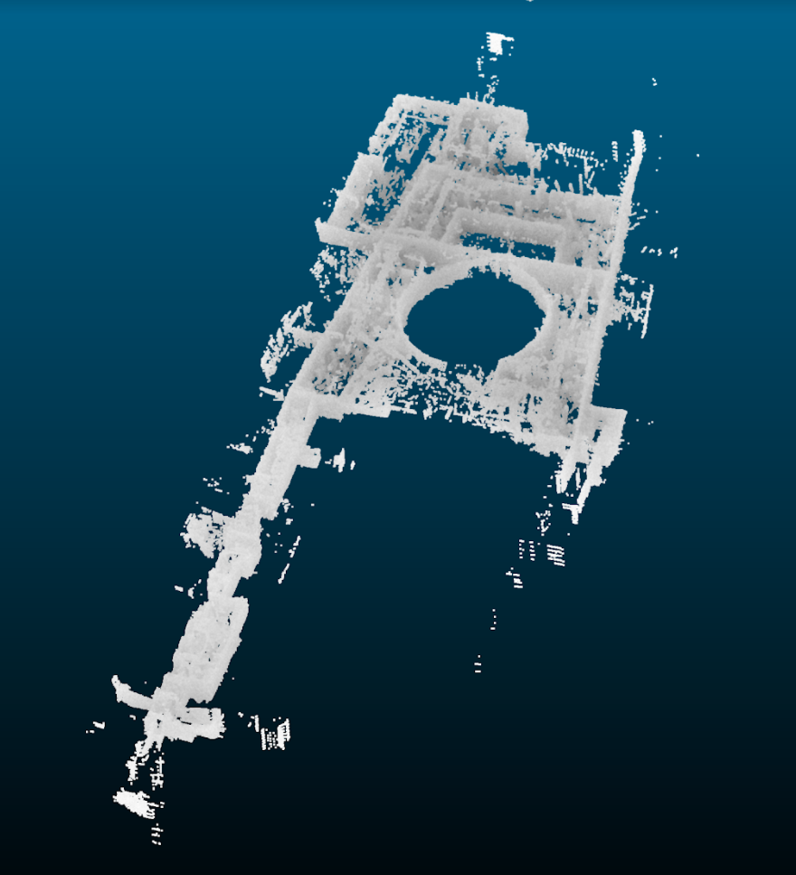

<!--
Copyright (c) 2022 Boston Dynamics, Inc.  All rights reserved.

Downloading, reproducing, distributing or otherwise using the SDK Software
is subject to the terms and conditions of the Boston Dynamics Software
Development Kit License (20191101-BDSDK-SL).
-->

# GraphNav Map Structure

GraphNav maps consist of waypoints and edges between the waypoints. A waypoint consists of a reference frame, a name, a unique ID, annotations, and sensor data. Each waypoint contains a snapshot, which bundles the various sensor data into one unit.

*   Waypoint data includes feature clouds, AprilTag detections, imagery, terrain maps, etc.
*   Edges consist of a directed edge from one waypoint to another and a transform that estimates the relationship in 3D space between the two waypoints.


## View Map Python Example

Use the [`view_map` example](../../../python/examples/graph_nav_view_map/README.md) in the Spot SDK to view maps recorded using Autowalk on the controller tablet, or using the Spot GraphNav service.

Point cloud data is captured at each waypoint. These data depict features that the robot encountered during the map recording process. The point clouds are colored by height, where blue is higher and red is lower.

The viewer also shows fiducials that were detected during the map recording process. Fiducials are shown as blue squares labeled with the fiducial ID. If multiple fiducials with the same ID are displayed near each other, this represents multiple detections taken at different times during recording.

Maps do not have a global coordinate system (like GPS coordinates, for example). Only the relative transformations between waypoints are known.


# Recording and Modifying Maps

The GraphNav map recording service is used to create and modify maps using robot data. Using the `StartRecording` RPC, you can tell the map recording service to begin creating a new map. You may then drive the robot around a site, and it will record a map. Afterwards (or at intervals during recording), you may download map data.

The [`recording_command_line` example](../../../python/examples/graph_nav_command_line/README.md#recording-service-command-line) in the Spot SDK shows how to record and modify maps at runtime, and how to download map data from the recording service.

## Creating waypoints

Waypoints are created by the robot every two meters during map recording. However, they can be created in areas where the robot’s path has more curvature as it navigates around corners and obstacles.

Call the `CreateWaypoint` RPC at specific locations in order to perform some action in a mission or when you want to explicitly maintain some mapping between a user event and a waypoint ID. Example: creating a waypoint at an inspection point.


## Creating edges

Edges are created automatically while recording is active. One edge will be created between every new waypoint that the recording service creates.

If you want to create edges manually, you can call the `CreateEdge` RPC in the recording service.


# Map Processing
Starting in the 3.0 SDK release, the GraphNav map processing service makes two new options available to modify maps, Topology Processing (automatic loop closure) and Anchoring Optimization. The map processing service is an RPC service interface which shares a map with the GraphNav Service. The map processing Service performs operations on the GraphNav map, and can either return results to the user, or write results into the shared map. The map processing service may be used after recording a map using the Map Recording Service.

The [`recording_command_line` example](../../../python/examples/graph_nav_command_line/README.md#recording-service-command-line) has examples for how to use the map processing service on a newly recorded GraphNav map.

## Topology Processing
The Topology of a GraphNav map refers to the connectivity between different Waypoints using Edges.  Below are some examples of  Maps with different topologies.



The recording service records one kind of map topology: the Chain. Chains always go from a starting point to an ending point. Chains are easy to create -- it only requires recording the robot’s current position and sensor data relative to the previous pose and sensor data. There are no connections between waypoints that aren’t along the chain, even if they happen to cross each other in physical space.

When starting a new recording while the robot is localized to an existing waypoint, the recording service will create a Branch -- which is simply a Chain starting from a waypoint within another Chain.

Loops are topologies where there is more than one possible path between two waypoints. The recording service is **unable to create loops** on its own. To create loops, you can manually call the `CreateEdge` RPC, or, starting in SDK 3.0, you may use the map processing service to automatically close loops.

### Why are loops important?
Any time the robot crosses its own path in physical space, there is an opportunity to create a topological connection (an edge) between where the robot currently is, and where it was in the past. This is called *"loop closure"*.


For example, if the robot has returned to its starting place after traversing hundreds of meters through a site, it would be desirable to know that the start and end points of the map are topologically connected.

For example, consider the chain:

```
start waypoint -> (1,000 waypoints) -> end waypoint
```

The robot may only travel along edges while using GraphNav, so without an edge between the starting and ending waypoints of the map, the robot is unable to travel betwen the start and end directly. For example, the command:

```
NavigateTo(start waypoint)
```
causes the robot to traverse the 1,000 waypoints it had recorded *in reverse* rather than walking directly from the end to the start.

To prevent this, we must **close the loop** between the starting and ending waypoint.

## Automatic Loop Closure
You can issue a `ProcessTopologyRequest` to the map processing service to automatically close loops in the GraphNav map.	This helps the robot know which areas of the map are topologically connected so that it can make smarter decisions about initializing its localization to the map and planning around it.

Note that Loop Closures in the Autonomy SDK affect both localization and navigation -- an edge is expected to be traversable by the robot in a physical sense (that is, the robot can walk from point A to point B if there is an edge between A and B), and it also encodes the relative transformation between the waypoints it connects.




There are two types of loop closure currently supported: odometry loop closures and fiducial loop closures.

**Odometry loop closures** occur whenever:
* The robot walks a total path length of less than 50 meters (for base platform robots) or 100 meters (for robots with LIDAR) and believes it is back at the same location (within 4 meters).
* That path **does not cross a staircase**.
* The resulting loop closure edge does not cross any body obstacles.

To close larger loops, the map processing service relies on fiducials. **Fiducial loop closures** occur whenever:

* The robot sees the same fiducial twice.
* In both instances that the robot sees the fiducial, the fiducial was less than 4 meters away and had low measurement error.
* The resulting loop closure edge does not cross any body obstacles.

> Note: the Autowalk app automatically calls topology processing after recording ends. SDK users must make sure to manually call the map processing service to enable this feature. See the recording_command_line.py example for how to call this service.

### Ensuring good topology

To make sure that the map processing service has the best chance of closing loops, adhere to the following guidelines:

* The more fiducials in the environment, the better.
* If the map is multi-floor, there must be at least one fiducial per floor.
* Try to pass as closely as possible to fiducials while recording.
* Try to record multiple pathways through the same site to maximize the chance that the robot will be able to navigate around obstacles.

# Anchorings and Anchoring Optimization
The 3.0 SDK introduces a new concept for GraphNav maps called *anchorings*. In addition to waypoints and edges, GraphNav maps now have an attached anchoring for waypoints and fiducials.

An *anchoring* is a mapping from waypoints to some global reference frame. That is, for every waypoint and fiducial, we have an `SE3Pose` describing the transform from a *seed* frame to that waypoint or fiducial.

For example, to get all of the positions of the waypoints relative to the seed frame, you can do this:

```python
# For each waypoint in the graph's anchoring, prints the (x, y, z) position of that waypoint.
def print_anchorings(graph):
    for anchor in graph.anchoring.anchors:
        pos = anchor.seed_tform_waypoint.position
        print("id: {} x: {} y: {} z: {}".format(anchor.id, pos.x, pos.y, pos.z))
```
> Note: it is not necessary for every waypoint in the graph to have an anchoring. GraphNav will use edge transformations to interpolate between the provided anchors.

All GraphNav maps have a *default anchoring*, which comes from the User Origin if it exists, or the starting waypoint otherwise. The default anchoring is computed by extrapolating robot odometry over the edges in the graph.

Additionally, the map processing tool can be used to **optimize the anchoring** via the `ProcessAnchoringRequest` RPC. An example for how to use this RPC using its default parameters can be found in the [`recording_command_line` example](../../../python/examples/graph_nav_command_line/README.md#recording-service-command-line). A more complex example can be found in the [`graph_nav_anchoring_optimization` SDK example](../../../python/examples/graph_nav_anchoring_optimization/README.md).

Anchoring optimization can be used to improve the **metric consistency** of a map's anchoring. An example is shown below:


*A real, 1km graph_nav map displayed from above before anchoring optimization is applied. The long red and yellow lines are loop closures from topology processing. The numbers are instances of fiducials stored in individual waypoints.*


*The same map after anchoring optimization has been applied. Notice that segments of the building which were disjoint before now align.*

> Note: the Autowalk app automatically calls anchoring optimization after recording ends. SDK users must make sure to manually call the anchoring optimization RPC to access this feature.

## What can you do with anchorings?

Anchorings can be used to describe the global relationships and layout between waypoints in a GraphNav map. The pose of the robot relative to the anchoring is also available in the Localization message returned by GraphNav as `seed_tform_body`.

Anchorings may also be used to display the GraphNav map relative to a blueprint, BIM model, or other pre-existing map. For details on how to achieve this, please see the [`graph_nav_anchoring_optimization` SDK example](../../../python/examples/graph_nav_anchoring_optimization/README.md).

There is also an SDK example for how to use GraphNav anchorings to extract a global 3D point cloud from a map and save it as a PLY file. This is located in the [`graph_nav_extract_point_cloud` SDK example.](../../../python/examples/graph_nav_extract_point_cloud/README.md)

 *An extracted point cloud from a real GraphNav map, viewed in a 3rdparty tool called [CloudCompare](https://www.danielgm.net/cc/).*

Starting in SDK release 3.0, anchorings can also be used to command the robot. The `NavigateToAnchor` command can be used to send the robot to an approximate `x, y, z` position relative to the seed frame. To do this, the robot will navigate over a series of waypoints and edges from its current location to the nearest waypoint to the given commanded pose, and will then walk in a straight line toward the commanded pose.

# Map Data Transfer
The GraphNav service has one active map instance on the robot that it shares with the GraphNav recording service. You can download the data stored in this map instance, or upload new data to the robot to replace or extend the current map instance.

## Downloading maps

Waypoints and edges have associated snapshots that store data the robot uses to compute localization and inform the robot’s locomotion.

*   Waypoint snapshots contain geometry and image data for localization.
*   Edge snapshots contain only the robot's footstep locations.
*   Edge annotations contain hints such as 'this edge traverses stairs' which informs the lower level locomotion systems on the robot.

The recording process creates waypoints, edges between them, and snapshot data on the robot.

Snapshot data are recorded and cached on the robot. To preserve and reuse a map, it must be downloaded from the robot. Graph data is not cached. Though the cache is large (up to 5GB) and persists across reboots, recording new maps might move waypoints and edges in a recorded map out of the cache. As a rule, we recommend downloading a recorded map at the conclusion of the recording process.

Because graph data is not cached, this data is lost when the robot is rebooted. Downloading snapshot data using DownloadSnapshot may work but should be downloaded before rebooting the robot.

Saving the map for reuse involves two steps:

1. Download the structure of the map by calling the `DownloadGraph` RPC.
2. Download snapshot data by calling the `DownloadWaypointSnapshot` and `DownloadEdgeSnapshot` RPCs.

Two steps are needed because snapshot data is very large. Snapshots are downloaded via a streaming RPC. The request is initiated by specifying which snapshot ID to download and, for waypoint snapshots, whether or not to include full image data in the download. Note that the full image data is not needed for the robot to navigate.


## Download a map from the controller tablet

To download a map recorded using Autowalk on the tablet, transfer the map to your local machine from the following location on the controller:


    Documents/bosdyn/autowalk/your_map.walk

Attach a USB cable between tablet or computer to transfer files. The map files should have the following directory structure on your local system:

    /your_map.walk
        graph
        waypoint_snapshots
        edge_snapshots


## Uploading maps

Maps stored on client computers can be uploaded to the robot for reuse in two steps:


1. The map structure is uploaded as a graph to the robot using the `UploadGraphRequest` RPC.
2. Snapshot data is uploaded to the robot using the streaming `UploadWaypointSnapshot` and `UploadEdgeSnapshot` RPCs.

See the [`graph_nav_command_line` and `recording_command_line` examples](../../../python/examples/graph_nav_command_line/README.md) for details about uploading edge snapshots, waypoint snapshots, and graphs to the robot.


<!--- image and page reference link definitions --->
[autonomous-top]: Readme.md "Spot SDK: Autonomy, GraphNav, and Missions"
[code-examples]: autonomous_navigation_code_examples.md "Autonomous navigation code examples"
[components]: components_of_autonomous_navigation.md "Components of autonomous navigation"
[typical]: typical_autonomous_navigation_use_case.md "Typical autonomous navigation use cases"
[autonomous-services]: autonomous_navigation_services.md "Autonomous navigation services"
[service]: graphnav_service.md "GraphNav service"
[map-structure]: graphnav_map_structure.md "GraphNav map structure"
[initialization]: initialization.md "Initialization"
[localization]: localization.md "Localization"
[locomotion]: graphnav_and_robot_locomotion.md "GraphNav and robot locomotion"
[missions]: missions_service.md "Missions service"
