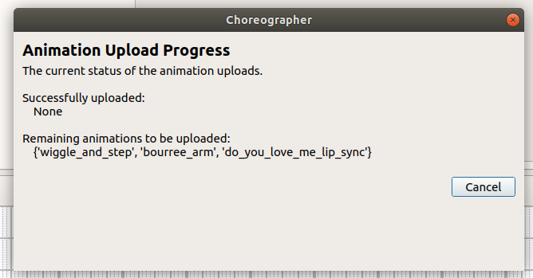

<!--
Copyright (c) 2021 Boston Dynamics, Inc.  All rights reserved.

Downloading, reproducing, distributing or otherwise using the SDK Software
is subject to the terms and conditions of the Boston Dynamics Software
Development Kit License (20191101-BDSDK-SL).
-->


# Animations in Choreography

The Choreography service is a framework for producing scripted motion through a list of customizable, predetermined moves. The dances can be customized through the track layering system, the parameters associated with each move, and the adjustable beats per minute of the dances. While these knobs provide a large amount of flexibility when authoring choreographies, there are scenarios where the exact output can't fully be expressed through the existing moves. To do this, we have developed an animation pipeline and API in the 2.4 Spot software release.

The animation pipeline allows you to create wholly custom sequences using 3D animation tools and integrate them in Choreographer scripts just like the predefined, default moves. For the intro sequence of the [“Spot’s On It” video](https://www.youtube.com/watch?v=7atZfX85nd4), we used Autodesk Maya to produce the kaleidoscoping dance moves. Autodesk Maya is a 3D animation software that gives fine-grain control for authoring and editing kinematics trajectories, but a range of tool sets can be used with this API.

<iframe width="600" height="400" allow="autoplay"
src="https://www.youtube.com/embed/7atZfX85nd4">
</iframe>

The base representation for the animation is a human-readable text file, so while an animated dance move can be created through 3D animation tools like Autodesk Maya, it can also be hand-written and edited. The primary component of the animated move is a set of timestamped key frames which specify the motion of the different tracks (arms, gripper, legs, or body). The timestamped keyframes that specify the animation can be densely spaced, as they would be from a 3D animation software, or they can be very sparse and the robot will interpolate between each key frame.Additionally, there are components of this text file which enable different animation-specific options and also specifies the different parameters which are associated with this move. A complete overview of the animation file format can be found in the ["Animation File Specification" document](animation_file_specification.md).

The animated move text files are be parsed into an `Animation` protobuf messages and uploaded to the robot. Once the animation is uploaded to the robot, it can be referenced by name within choreographies. This parsing step (from text file to protobuf message) happens automatically in Choreographer for both animations in the "animations" directory that matches the directory structure shown below, and also for animations uploaded through "File"->"Load Animated Move" menus.

```
dance_directory/
	choreographer.exe
	animations/
		bourree_arm.cha
		my_animation.cha
```

There is a python script in the `bosdyn-choreography-client` package, called `animation_file_to_proto.py`, which provides client access to the same functions used by Choreographer to complete the text file to protobuf animation parsing.

When Choreographer is opened, it begins uploading all animations automatically to every connected robot. Once an animation is uploaded, it will last on the robot until it is rebooted. A dialog will appear indicating the status of all animations being uploaded; the image below shows an example of this dialog. If an animation fails to upload, then check the terminal where the Choreographer executable is running. An error message should be present on the terminal and provide a description of the part of the animation that was invalid.



## Choreography Logs for Animations

To aid in creating animated dance moves without 3D animation software, we have added choreography logs. These logs can be recorded through the choreography log service while driving the robot around with the tablet, moving the robots arm around manually (while it is powered off), or running an existing choreography. The choreography log contains high-rate timestamped key frames with the robot's joint state, foot contacts, and body pose relative to the animation frame (defined by the robot's foot state when the choreography log started). These key frames can be used directly for the animation file's key frames.

The choreography logs are divided into two types: auto and manual. The log types are used to specify the log's duration and when it is recorded. The "auto" log is recorded whenever a choreography is being executed by the robot. The robot will start recording an "auto" log automatically when a choreography begins, and stop 3 seconds after the completion of a choreography. The "manual" log can be recorded whenever and its duration is defined by when the robot receives a `StartRecordingState` RPC to when it receives a `StopRecordingState` RPC. The manual log has a maximum of 5 minutes of recording. The robot will only keep the most recent "auto" log and the most recent "manual" log saved - therefore the logs must be downloaded immediately to ensure data is not lost.

In Choreographer, there are buttons to start/stop recording the "manual" log (shown below). As well, there are buttons to download each log type (shown below). The log can be downloaded as a [pickle file](https://docs.python.org/3/library/pickle.html), which tightly packages the data stored as a python dictionary into a serialized object. This is the default format and will be used if no file extension is specified in the file name when saving the log. Additionally, it can be downloaded as a text file, which saves the `ChoreographyStateLog` protobuf message as a protobuf-to-text message; to save in this format, when typing the log name the ".txt" should be explicitly included.


The API for the choreography logs is described in the [Choreography Service document](choreography_service.md) and can be accessed via the API in the choreography client.