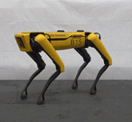
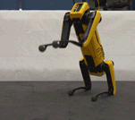
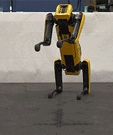
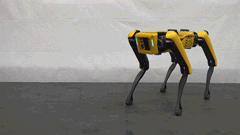
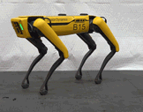
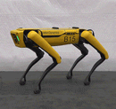
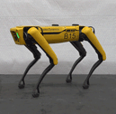
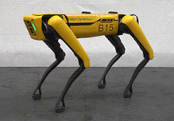
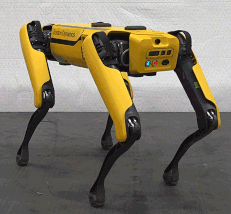

<!--
Copyright (c) 2021 Boston Dynamics, Inc.  All rights reserved.

Downloading, reproducing, distributing or otherwise using the SDK Software
is subject to the terms and conditions of the Boston Dynamics Software
Development Kit License (20191101-BDSDK-SL).
-->

# Choreography Moves Reference

This provides a guide describing each move at a high level, any parameters used by the move, and a gif demonstrating the move with default parameters (for most moves). More information about the moves can be found in the [proto definitions](../../../choreography_protos/bosdyn/api/README).

## Whole-Robot Moves

### self_right

Activate the self-right behavior.  Primarily useful as the first move in a dance if you wish to start from a non-standard posture.  Nominally requires 5 seconds, but can be extended to ensure that it completes.

***No Parameters***

### random_stretch

Extends any extendable moves immediately prior to it by a random number of slices between 0 and the duration of the stretch move.  Then immediately jumps to the end of this move.  Note that this will change the duration of a choreography sequence.

***No Parameters***

### front_up

Lifts the front feet, then returns to a stand. Can be extended to adjust that duration of the hind-feet-only stance, but longer durations will be unreliable.  Lifts off 2 slices from the start of the move and touches down one slice from the end of the move.

Parameter | Effect
--|--
mirror | If true, raises the hind legs instead of the front legs.

### jump

Jumps in place.  Nominally lasts one beat, but may take more slices at faster tempos.

Parameter | Effect
--|--
yaw | What orientation to land in.
absolute | If true, yaw is interpreted relative to the orientation the choreography sequence began in.  If false, yaw is interpreted relative to the orientation before entering the move.
flight_slices | How long the jump should last with all feet off the ground measured in slices.  Depending on tempo, higher values will be unreliable.
stance_width/stance_length | The footprint the robot should land its jump in.
split_fraction | Splits the liftoff and touchdown into two pairs of two legs.  In fraction of of swing with two legs in flight, so 0 means all legs fully synchronized.
lead_pair | If split_fraction is not 0, indicates which legs lift off first. Default AUTO mode will select a pair based on the forward and left parameters.
translation | Distance and direction the robot should jump.

### stand_to_kneel

Transitions from standing to kneeling on the hind legs.  Requires 2 seconds.

***No Parameters***

### kneel_to_stand

Transitions from kneeling on the hind legs to a stand.  Requires 2.4 seconds.

***No Parameters***

## Legs & Body Moves

### running_man

Spot’s version of the “running man” dance move.  Is extendable to run for an arbitrary duration.

Parameter | Effect
--|--
velocity | By default, it will dance in place, but can move around in the world.
pre_move_cycles | How many slices to dance in place before moving at the specified velocity.
swing_height | How high to pick up the feet.
spread | How far to slide the feet backward from where they’re initially placed.
reverse | If true, will step backwards and slide forward, the reverse of the normal motion.

### hop

Runs the hop gait. Is extendable to run for an arbitrary duration.

Parameter | Effect
--|--
velocity/yaw_rate | The steering command.
stand_time | How much before the end of the nominal move to start going to a stand.

### kneel_leg_move

While kneeling, move the front legs to a specified joint configuration.  Nominally takes one beat (4 slices), but can be extended to go slower.

Parameter | Effect
--|--
hip_x, hip_y, knee | Joint angles for the front-left leg.
mirror | Should the left and right legs move in a mirrored manner.  If false, front-right leg will move to the same joint configuration as the front-left.  If true, the front-right hip_x angle will have the opposite sign as the front-left leg and the other joint angles will be the same.
easing | Controls the velocity profile of the motion.

### kneel_clap

While kneeling, clap the front feet together.  Takes one beat (4 slices).

Parameter | Effect
--|--
direction | The movement direction of the clap in the flat_body frame (z is up, x is direction the robot faces).
location | The location of the clap in body frame.
speed | The speed of the clap.
clap_distance | How far apart the feet will be prior to clapping.

### kneel_circles

While kneeling, move the front feet in circles in the body-XZ (sagittal) plane.  The two feet will be 180 degrees out of phase. Can be extended for any desired duration.

Parameter | Effect
--|--
location | The location of the center of the circles in body frame.
beats_per_circle | The duration of a full circle in beats.  Ignored unless number_of_circles = 0.
number_of_circles | Number of circles to perform.  If 0, then use beats_per_circle.
offset | Distance between the circle plane and the body centerline.
radius | Size of the circles that the feet move in.
reverse | Reverses the circle direction.  Nominal direction is away from the body on top.

### sit

Sit the robot down.  Requires at least 3 seconds.

***No Parameters***

### stand_up

Stand the robot up from a seated position.   Requires at least 2 seconds.

***No Parameters***

### sit_to_sprawl

Starting from a seated position, rolls the robot onto its side/back.  Intended to prep the robot for a more "dramatic" self-right.

Parameter | Effect
--|--
side | Which side to roll to.

## Legs Moves

### step

Take a single step with one or two feet.  Nominally requires one beat (4 slices), but can be extended to step slower.  If stepping with two feet, especially both front or both hind feet, longer steps will be unreliable.  Lifts off one slice after the move begins and touches down one slice before it ends.

Parameter | Effect
--|--
foot/second_foot |  Which feet to step with.  If only a single foot is desired, second_foot should be set to LEG_NO_LEG.
offset | Where to step to relative to a nominal stance for the first foot.
mirror | Determines whether the second_foot (if there is one) should have the same offset as the first foot (false) or the opposite offset (true).
swing_waypoint | Defines a waypoint that the swing leg must go through between liftoff and touchdown.  If left at {0,0,0}, no waypoint will be added, and the system will take a normal swing.
swing_height | How high to lift the foot/feet.  Does nothing if a swing_waypoint is specified.
liftoff_velocity | How quickly to raise the foot/feet. Does nothing if a swing_waypoint is specified.
touchdown_velocity | How quickly to lower the foot/feet. Does nothing if a swing_waypoint is specified.

### turn_2step

Take two steps to turn in place.  Requires 2 beats (8 slices).

Parameter | Effect
--|--
yaw | How far to turn.
absolute | If true, yaw is interpreted relative to the orientation the choreography sequence began in.  If false, yaw is interpreted relative to the orientation before entering/ro the move.
swing_height | How how to pick up the feet.  Zero indicates to use a default swing.
swing_velocity | How quickly to lift off and touch down the feet | Zero indicates to use a default swing.

## pace_2step

Take two steps to translate using a pace gait (legs on the same side of the robot move together).  Requires 2 beats (8 slices).  Caution: Large lateral steps require a high-traction floor.

Parameter | Effect
--|--
motion | How far to move.
swing_height | How how to pick up the feet.  Zero indicates to use a default swing.
swing_velocity | How quickly to lift off and touch down the feet | Zero indicates to use a default swing.
absolute | motion is measured relative to the dance’s starting location rather than the current location.  May not be accurate for longer dances with lots of stepping.

### crawl

Locomotes, taking one step every beat.  Can be extended for any desired duration.

Parameter | Effect
--|--
velocity | Desired velocity of the robot.
swing_slices | Duration of a swing in slices.  An entire gait cycle takes 4 beats (16 slices), so at the maximum value of 8 slices, there will always be two feet on the ground, as in the Amble gait.  With a value of 4, there will always be one foot on the ground, as in the crawl gait.

## Body Moves

### rotate_body

Rotates the body to a desired orientation.  Nominally takes one beat (4 slices), but can be extended to go slower.

Parameter | Effect
--|--
rotation | The desired body orientation.
return_to_start_pose |  If true, will return to the previous body pose by the end of this move.  If false, will remain in the specified position.

### rotate_body_sharp

Identical to the rotate_body move, but moves to the desired position quickly and returns (unless configured not to return) more slowly.

***No Parameters***

### body_hold

Moves the body to a specified position/orientation and holds it steady there for the specified duration.

Parameter | Effect
--|--
rotation/translation | The desired pose.
entry_slices | How long to spend transitioning to the desired pose.
exit_slices | How quickly to transition back to the original pose.  If set to 0, will remain at the specified pose.

### body_const

Holds the body at whatever pose an immediately preceding body-track move commanded it to.  Pertains to both orientation and translation.  Can be extended to any desired duration.

***No Parameters***

### sway

Sway back and forth to the beat.  A full back/forth cycle takes 2 beats.

Parameter | Effect
--|--
vertical/horizontal/roll | How much motion in the respective directions.
pivot | Which portion of the body remains stationary.
style | Modifies the velocity profile of the motion.
pronounced | How exaggerated the style is.  Smaller values will be closer to the SWAY_STYLE_STANDARD.
hold_zero_axes | If set to true, will maintain the previous pose in whichever axes 0 motion is specified.  If false, those axes will be allowed to return to nominal.

### random_rotate

Rotate the body in a random, chaotic manner.  Rotation in each axis is generated independently.  Can be extended to any desired duration.

Parameter | Effect
--|--
amplitude | How far from the nominal pose to rotate in each axis.
speed | How quickly to rotate in each axis.
speed_variation | How much to vary the speed.  Controls the ratio between the slowest and fastest moves.  When set to 0, there will be no variation (i.e. all moves will be the same speed).
num_speed_tiers | Can create multiple tiers of speed.
tier_variation | How different the speed for the slowest tier is from the fastest_tier.

### twerk

Lowers the robutt down and back up once.  Lasts for one beat (4 slices).
Author’s note: I’m sorry.

Parameter | Effect
--|--
height | How much to lower the robutt.

### butt_circle

Move the robutt, head, or both head and robutt in a circle.  Extendable to the desired duration.

Parameter | Effect
--|--
radius | How large a circle to move in.
beats_per_circle: The duration of a circle in beats (4 slices each).  Mutually exclusive with number_of_circles.  Will be ignored unless number_of_circles = 0.
number_of_circles | The number of circles to perform.  This specification is mutually exclusive with beats_per_circle.  If number_of_circles = 0, beats_per_circle will be used instead.
pivot | What part of the robot to pivot around.  Pivoting around the front means the robutt will be moving in circles.

## Arm Moves

### nod
Moves the WR0 joint up and back down for one beat (4 slices).  If done from a stow pose, will raise the hand.

***No Parameters***

### stow

Returns the arm to a stowed configuration.  Nominally takes one beat (4 slices), but can be extended to go slower.

***No Parameters***

### unstow
Moves the arm to a deployed configuration. Nominally takes one beat (4 slices), but can be extended to go slower.

***No Parameters***

### shoulder_left
Rotate the SH0 joint to move the gripper to the left.   Nominally takes one beat (4 slices), but can be extended to go slower.

***No Parameters***

### shoulder_right
Rotate the SH0 joint to move the gripper to the right.   Nominally takes one beat (4 slices), but can be extended to go slower.

***No Parameters***

### double_elbow_out

Intended for use from a stowed configuration.  Rotates the SH0 joint to move the elbow to the right twice in one beat.

***No Parameters***

### arm_move

Moves the arm to the specified joint angles.   Nominally takes one beat (4 slices), but can be extended to go slower.

Parameter | Effect
--|--
angles | The specified joint angles, including the gripper angle.

### gripper

Moves the gripper to the specified angle, while holding the rest of the arm still.  Duration can be set to any number of slices, but speed will be determined by parameter.  Once it reaches the specified angle it will stop.  If the selected duration is too short to complete the move given the configured speed, the robot will remain at whatever angle it got to when the move ends.

Parameter | Effect
--|--
angle | The desired gripper angle.
speed | The desired velocity of the gripper in rad/s.

### chicken_head

Holds the arm stationary in the world regardless of how the body is moving.  Can also be configured to move in a fixed oscillation in the world.

Parameter | Effect
--|--
bob_magnitude | A vector for how to move in the world.  Zero vector means remain stationary.
bob_frequency | The period of the oscillation in slices.  Negative value indicates no oscillation.
bounce | Adds an asymmetric vertical oscillation to the gripper position.  Also at bob_frequency.

