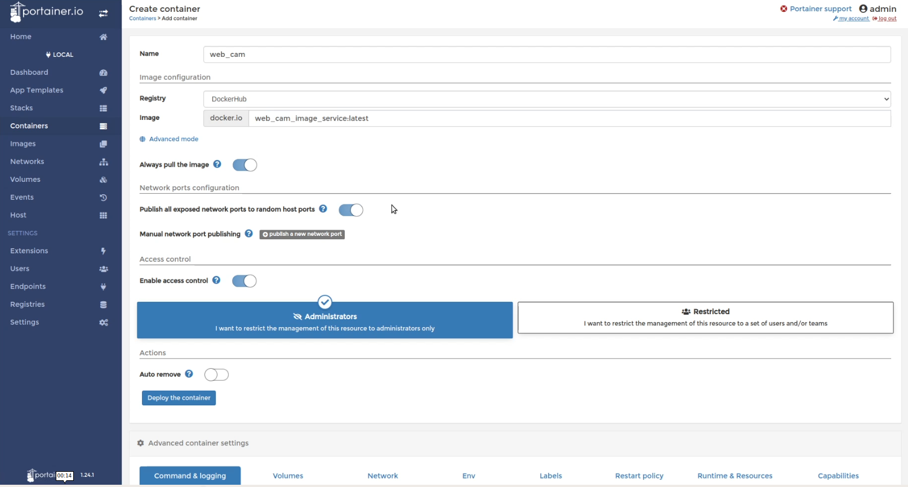
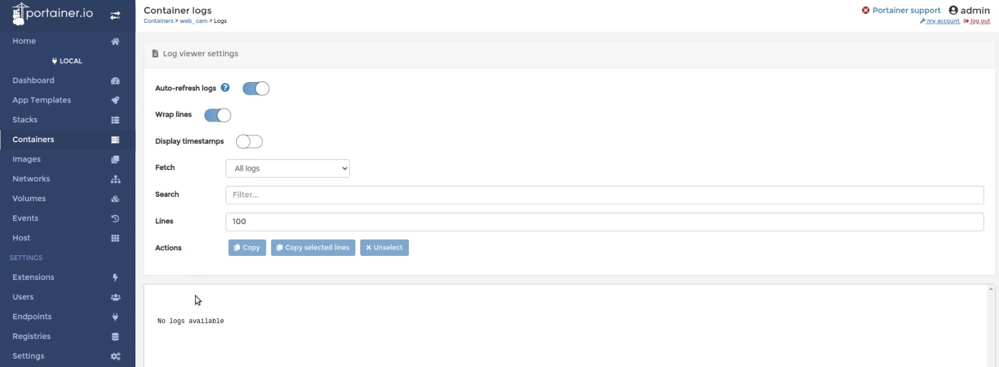

<!--
Copyright (c) 2022 Boston Dynamics, Inc.  All rights reserved.

Downloading, reproducing, distributing or otherwise using the SDK Software
is subject to the terms and conditions of the Boston Dynamics Software
Development Kit License (20191101-BDSDK-SL).
-->

# Running Custom Applications with Spot
Spot's computing power can be extended through additional computation payloads mounted on the robot. Boston Dynamics offers Spot CORE and Spot CORE AI computation payloads, but users can attach other types of computation payloads as well. This document describes how to configure software to run on these computation payloads. Most instructions describe steps on how to manage custom software on the Spot CORE, but these steps are applicable to other computation payloads as well.

The purpose of computation payloads is to run custom software applications on the robot that interact with the robot software system and the other payloads attached to Spot. For Spot CORE, we suggest using the provided docker framework to install, configure and run custom software. This document describes how to create docker images in the [Create Docker Images](#create-docker-images) section, and how to manage docker containers in Spot CORE or other computation payloads in two different ways in the [Manage Docker Containers](#manage-docker-containers-in-spot-core) section. The [Portainer section](#portainer-configuration) describes how to use Portainer to manage docker containers. This feature is new in Spot release 2.1. The [Command-line section](#command-line-configuration) describes how to use command-line tools, such as `scp`, `ssh` and docker CLI (Command Line Interface) to run docker containers in a computation payload.

Multiple Spot SDK examples support dockerization and running as docker containers. The main examples are listed below, but all the other examples can be easily configured to run as docker containers by duplicating the docker configuration in the examples below.
* [Data Acquisition Plugins](../../python/examples/data_acquisition_service/README.md)
* [Ricoh Theta](../../python/examples/ricoh_theta/README.md)
* [Spot Detect and Follow](../../python/examples/spot_detect_and_follow/README.md)
* [Web Cam Image Service](../../python/examples/web_cam_image_service/README.md)

## Create Docker Images
The first step is to create a docker image with the software application and its dependencies. Docker containers are dependent on images and use them to construct a run-time environment and run an application. The instructions to create a docker image are specified in a file, usually named `Dockerfile`. The `Dockerfile` specifies what base docker image to start from, what additional software and libraries to install on top of the base image, and what software needs to be run when the container starts. All the Spot SDK examples listed above contain a `Dockerfile`.

### Build Docker Images
The docker image, which is used to run a container with the software component, can be built and saved to a tar file using the following commands, where {IMAGE_NAME} represents the desired docker image name.

```
sudo docker build -t {IMAGE_NAME} .
sudo docker save {IMAGE_NAME} > {IMAGE_NAME}.tar
```

### Test Docker Images Locally
Before configuring and running a docker container on a computation payload, we recommend to test the container on a local environment first, such as on a development laptop. To start a docker container and its configured software application, run:

```
sudo docker run -it --network=host {IMAGE_NAME} {ROBOT_IP} {APPLICATION ARGUMENTS}
```
where:
* {IMAGE_NAME} represents the name of the docker image as specified in the build step.
* {ROBOT_IP} represents the IP of the Spot robot (`192.168.80.3` if connected to robot's wifi).
* {APPLICATION ARGUMENTS} represents any additional arguments the application that runs in the docker container takes as input. Most software applications that communicate with the services running on the robot will need the following arguments `--guid {PAYLOAD_GUID} --secret {PAYLOAD_SECRET} --host-ip {LOCAL_IP}`. Some software applications might use the `--username\--password` combination to authenticate with the robot instead of `--guid\--secret` These arguments represent:
    * {PAYLOAD_GUID} represents the payload GUID. Refer to the [Python payload registration code example in the Spot SDK](../../python/examples/payloads/README.md) for how to register a massless payload and use the GUID of the example payload for testing. For software running on dedicated payloads, such as on Spot CORE or other computation payloads, we recommend using the `GUID` of that computation payload.
    * {PAYLOAD_SECRET} represents the payload secret.  Refer to the [Python payload registration code example in the Spot SDK](../../python/examples/payloads/README.md) for how to register a massless payload and use the secret of the example payload for testing.  For software running on dedicated payloads, such as on Spot CORE or other computation payloads, we recommend using the `secret` of that computation payload.
    * {LOCAL_IP} represents the IP of the platform where the docker is running.

## Manage Docker Containers in Computation Payloads
This section describes two ways to manage docker containers on a computation payload, using Portainer already included in Spot CORE as of release 2.1, or command-line tools.

### Portainer Configuration
In Spot release 2.1, Spot CORE comes preloaded with [Portainer](https://www.portainer.io) software to manage the docker containers. Portainer is a complete software solution for container management to speed up software deployments and troubleshooting on the Spot CORE. It is the recommended method for managing docker containers on Spot CORE. We also recommend using Portainer and following these instructions with other computation payloads as well.

Check the Spot CORE version to make sure it is 2.1 or higher by ssh-ing onto the Spot CORE and running `cat /etc/spotcore-release`. If it is not up to date, upgrade to the latest Spot CORE release by following the [instructions to upgrade](https://support.bostondynamics.com/s/article/How-to-update-Spot-CORE-software).

Once the Spot CORE is updated, the docker file can be deployed from the Portainer web console. To access the web console, go to `https://192.168.80.3:21900`, log in, and then click the "Local" endpoint. To upload the tar file, click the "Image" tab on the left side of the web console, and then click the "Import" button in the "Images" section, as shown below.


Select the tar file created by the `docker save` command above, and then click "Upload". If the upload fails, try changing the permissions of the tar file using the command:
```
sudo chmod a+r {IMAGE_NAME}.tar
```

Once the upload completes, go to the "Containers" tab in Portainer and add a container by clicking the "Add Container" button. In the configuration page shown below:


set the follow fields:
* "Name" = Name of the container. This should be set to a unique string that describes the container.
* "Image" = {IMAGE_NAME}:latest. {IMAGE_NAME} represents the image name used to build the docker image.
* Under the "Command & logging" tab in the container configuration page, add all of the arguments in the "Command" field. Specifically, these arguments `--host-ip {HOST_COMPUTER_IP} --guid {PAYLOAD_GUID} --secret {PAYLOAD_SECRET} ROBOT_IP` should be required by all software applications running on Spot CORE that need to communicate with on-board services. Make sure the {HOST_COMPUTER_IP} matches the computation payload's IP (by default, this is `192.168.50.5` for the rear-mounted payloads), and ROBOT_IP matches the robot IP from the perspective of the Spot CORE (by default, this is `192.168.50.3`). {PAYLOAD_GUID} and {PAYLOAD_SECRET} should correspond to the computation payload credentials. The list of arguments specified in this section should also include additional arguments expected by the application.
* Under the "Network" tab in the container configuration page, set the "Network" field to `host` so ports are forwarded correctly between the host OS and the docker container.
* Under the "Restart policy" tab in the container configuration page, set the policy to "Unless stopped". This will allow the docker container to continue to keep running all the time (even after rebooting the spot core) unless it is manually stopped by a user in Portainer.

Once all the necessary fields are configured, select "Deploy the container" to run the software application configured in the docker container on Spot CORE. The screenshot below shows the web console view of a running container.

The log statements generated by the software application running in the docker container can be seen by clicking the "Logs" link, as shown in the screenshots below.


### Command-line Configuration
To run the docker container on a computation payload without using Portainer, first copy the docker image tar file and then manually run it on the computation payload. To copy the dockerfile, run:
```
scp -r -P 20022 {IMAGE_NAME}.tar spot@192.168.80.3:
```
Then, ssh onto the computation payload, and load the docker file locally:
```
sudo docker load -i {IMAGE_NAME}.tar
```
To run the docker container and the software application in it, execute:
```
sudo docker run -it --network=host {IMAGE_NAME} 192.168.50.3 {APPLICATION ARGUMENTS}
```
with the arguments as described in the section [Test Docker Images Locally](#test-docker-images-locally). Note, the `host-ip` in the example command is currently set for a Spot CORE attached to the rear port and the robot hostname is needed for a service running on the Spot CORE communicating with the on-board software.

The manual configuration described in this section does not persist across reboots without additional configuration.