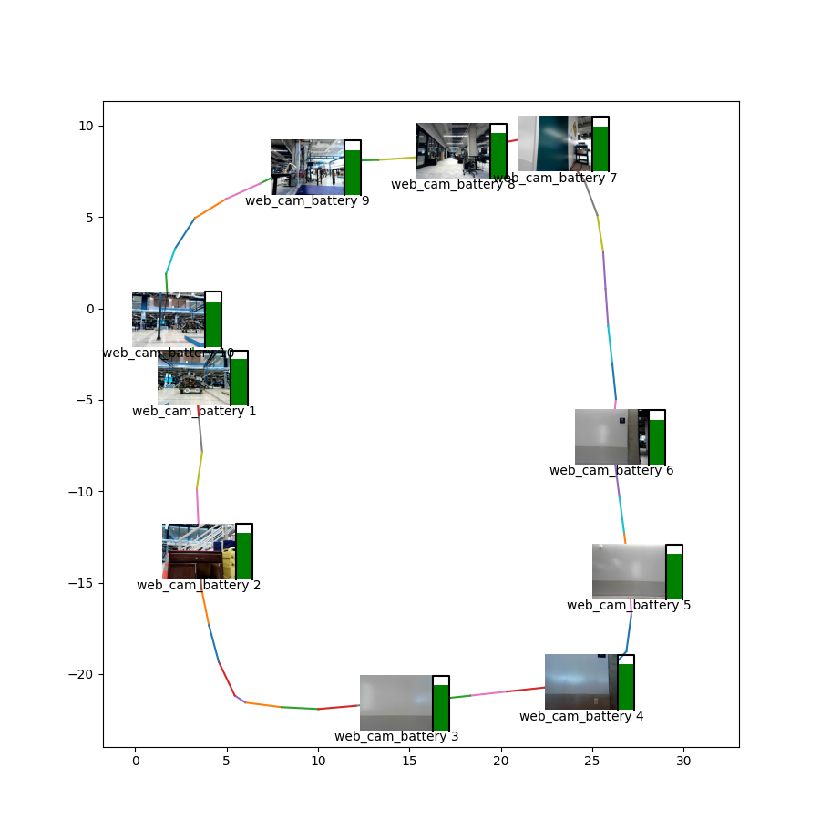

<!--
Copyright (c) 2022 Boston Dynamics, Inc.  All rights reserved.

Downloading, reproducing, distributing or otherwise using the SDK Software
is subject to the terms and conditions of the Boston Dynamics Software
Development Kit License (20191101-BDSDK-SL).
-->

<script type="text/javascript" src="video_play_at_scroll.js"></script>
<link rel="stylesheet" type="text/css" href="tutorial.css">
<link href="prism.css" rel="stylesheet" />
<script src="prism.js"></script>

# Tutorial: Data Collection

## Overview

In this tutorial, you’ll integrate sensors with the Spot platform and use them for autonomous data collection. You will learn how to:

- Write an image service.
- Write a data acquisition plugin service.
- Package those services for easy deployment to the robot.
- Create actions and record missions using our new sensors.
- Upload the data to cloud storage.
- Process the data collected by those missions.

At the end of this tutorial, you will have a system that can repeatably walk around an environment, collect images and data, and build a map that visualizes everything together.



## Requirements

- Spot robot
- Spot SDK version 3.1 or greater
- A payload computer mounted to Spot (such as a CORE I/O).
- [Optional] A webcam

## Contents

- [Part 2: Capturing images](daq2.md)
- [Part 3: Capturing other data](daq3.md)
- [Part 4: Deploying to the CORE I/O](daq4.md)
- [Part 5: Collecting data](daq5.md)
- [Part 6: Processing collected data](daq6.md)

## Initial setup

### Setting up Python 3 and the Spot SDK

<ul>
    <li>Follow the <a href="https://dev.bostondynamics.com/docs/python/quickstart">Quickstart guide</a> for the Spot SDK.</li>
    <li><strong>Note</strong>: the <strong>virtualenv</strong> section of that guide is <strong>required</strong> for this tutorial.
</ul>

#### Environment variables for this tutorial

This tutorial will use a set of environment variables for the various example commands. By setting up these environment variables now, you can directly copy and paste the example commands.

```sh
# Wifi IP address
export ROBOT_IP=192.168.80.3

# Specific to your robot
export BOSDYN_CLIENT_USERNAME=<Your username on the robot>
export BOSDYN_CLIENT_PASSWORD=<Your password on the robot>
```

Use the `hello_spot` example to test that you can control the robot correctly.
Once you have successfully made Spot move using the API, you're ready to go.

```sh
source my_spot_env/bin/activate # enter your virtualenv
cd ~/spot-sdk/python/examples/hello_spot # or wherever you installed Spot SDK
python3 hello_spot.py $ROBOT_IP
```

### Register a payload for development

For developing services to interact with Spot, it is often useful to first test them out from your own computer. To do that you will need two things: payload credentials registered with the robot, and your own IP address that the robot will use to contact your services.

Below we create and register new payload credentials. This will allow you to run a service on our development machine in the same way that you will run it on a payload computer, and simply de-authorize that payload from the robot when you are finished.

```sh
# The IP address you use to communicate with the robot
# This can be determined by running python3 -m bosdyn.client $ROBOT_IP self-ip
export SELF_IP=192.168.80.100

# Generate a guid/secret pair for development.
export CRED_FILE=~/spot_dev_creds.txt

# One-time set up of credentials.
export GUID=$(python3 -c 'import uuid; print(uuid.uuid4())')
export SECRET=$(python3 -c 'import uuid; print(uuid.uuid4())')
printf "$GUID\n$SECRET" > $CRED_FILE
```

Register this payload with the robot using the `bosdyn.client` command line program that is installed with the SDK.

```sh
$ python3 -m bosdyn.client $ROBOT_IP payload register --payload-name "Dev Payload" --payload-guid $GUID --payload-secret $SECRET

Payload successfully registered with the robot.
Before it can be used, the payload must be authorized in the Admin Console.
```

You can now authorize this payload through the robot's web interface (https://192.168.80.3 when connected over WiFi).

## Head over to [Part 2: Capturing images](daq2.md) >>

[Next Page >>](daq2.md)
