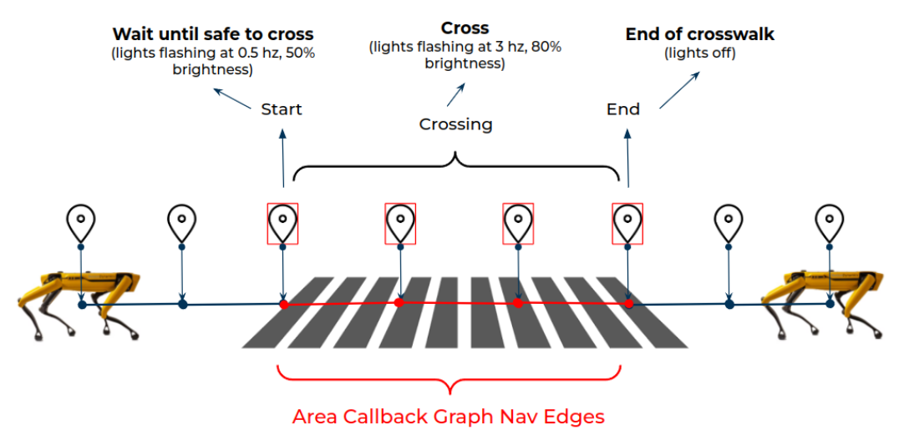
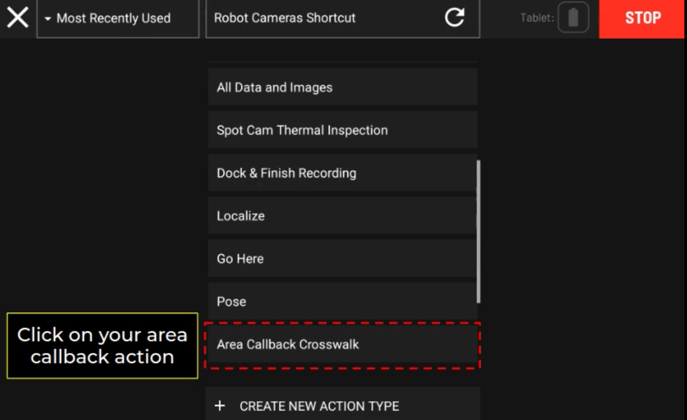
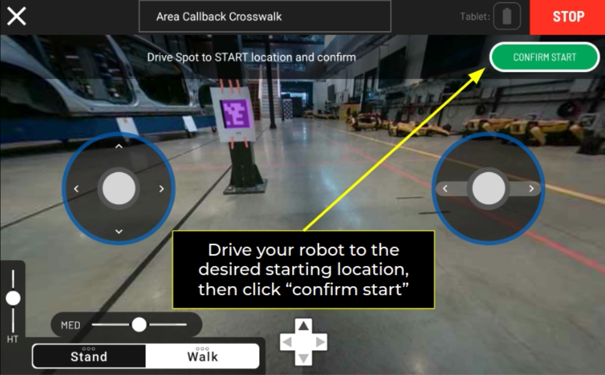

<!--
Copyright (c) 2023 Boston Dynamics, Inc.  All rights reserved.

Downloading, reproducing, distributing or otherwise using the SDK Software
is subject to the terms and conditions of the Boston Dynamics Software
Development Kit License (20191101-BDSDK-SL).
-->

# Area Callback Tutorial

We sometimes want the robot _to execute a sequence of actions anytime the robot is at the certain location in the map_. That is where we can use **Area Callbacks**. An Area Callback allows the user to associate certain areas with specified actions, such as safety checks at the crosswalks, opening doors, and signaling the environment using lights and sounds.

See the [Area Callback documentation](../../../docs/concepts/autonomy/graphnav_area_callbacks.md) for more information about what Area Callbacks are and how they work.

## Example: Crosswalk Spot CAM Light


Below is an example that does the following:

- the robot gets to the _start_ of the callback (Area Callback region)
- the robot _waits and checks_ its surrounding for the forklift (ML example included as pseudocode), during which it flashes Spot CAM light at 1Hz / 50% brightness
- once the robot confirms that the crosswalk is clear of forklifts, it starts _crossing_ the region, during which it flashes Spot CAM light at 3Hz / 80% brightness
- the robot reaches the _end_ to turn off the Spot CAM light and proceed to complete the rest of the mission

Let's take a look at the example to see how that can be done. We will go over some of the important lines in the `area_callback_crosswalk.py` example.

### Initialization

Below two lines lets the user to specify the area callback **policy** at the start and the end of the region.

```python
self.stop_at_start()
self.continue_past_end()
```

These policies determine the type of behavior that robot will be executing at the start and the end of the area callback region. Available policies are listed below:

- `continue_past_start()` / `continue_past_end()`: Setting the policy to `continue` means that the robot will not pause to complete an action at the start/end of the area callback region.
- `stop_at_start()` / `start_at_end()`: Setting the policy to `stop` means that the robot will pause at the start/end of the area callback region until the user switches the policy to `continue`. Normally, `stop` mode will be used to execute an action that does not require robot body lease (i.e. searching for forklift, connecting to bluetooth device)
- `control_at_start()` / `control_at_end()`: Setting the policy to `control` means that robot will pause at the start/end of the area callback region until the user switches the policy to `continue`. The difference of `control` mode will be used to execute an action that does require robot body lease (i.e. look both ways, using robot arm to open/close the door). Note that `control_at_<LOCATION>()` methods can be used with the `block_until_control()` if the robot has nothing to do until it gets the control. Once you are done with robot action, calling the `continue_past_<LOCATION>()` will automatically return the lease back to the robot.

Below is an example for initiating the thread for Spot CAM LED lights. We have provided the `LightsHelper` class that can be used to run different lighting modes for when the robot is waiting to cross the road versus when the robot is crossing the road. This helper is a context manager that will run a separate thread to control the lights while the main thread continues inside the context.

```python
with LightsHelper(robot, frequency, brightness):
    # Lights will flash here
# Lights will stop flashing here
```

### Begin

We are not using any configurations yet, but this is the place where you will be unpacking user input parameters. TBD.

```python
def begin(
            self, request: area_callback_pb2.BeginAssistRequest
    ) -> area_callback_pb2.BeginAssistResponse.Status:
        # Unpack any configuration settings
        return area_callback_pb2.BeginAssistResponse.STATUS_OK
```

### Run

`self.block_until_arrived_at_start()` allows the code to stop running _until_ the robot reaches the _starting_ location of the area callback region.

Now that the robot has reached the start location, start the light mode for waiting.

```python
# Actions to be executed at the start of the Area Callback region
with LightsHelper(self.robot, 0.5, 0.2): # start the lights for waiting at the zone
    self.safe_sleep(5.0)
```

Below is a placeholder pseudocode for where you would insert your ML forklift detection model. Here, you want to place a function inside the `with` statement that will exit when the road is clear of the forklift so that the robot can proceed to navigate the crosswalk.

```python
    # Wait until the region is clear of forklifts
    while not clear_of_forklifts():
        self.safe_sleep(0.1)
```

Once you are clear of the forklift, `self.continue_past_start()` allows the robot to move past the starting location of the area callback region. In short, `self.continue_past_start()` overrides the `self.stop_at_start()` policy that was set in the initialization step. Once again, you may want to include any actions that robot should execute _after_ the robot reaches the start and _before_ crossing the Area callback region between `self.block_until_arrived_at_start()` and this line of code - such as checking for the forklift. As shown below, the example starts the Spot CAM light for crossing the road.

```python
# Actions to be executed while crossing the Area Callback region
with LightsHelper(self.robot, 3, 0.8):
    self.block_until_arrived_at_end()  # block the code until the robot reaches the end
```

### End

To finish the callback, simply return from the callback's `run()` method. This callback does not have any cleanup beyond that which is already handled in the `LightsHelper` context manager.

## Running the example without graph nav & recording

This tutorial will run the area callback server on your laptop. We will use "fake" client code so that you can run your example before the full graph-nav integrated solution is ready. This tutorial assumes that you have your environment set up for the sdk examples to run. Please refer to [this guide](https://dev.bostondynamics.com/docs/python/quickstart) for more information on setting up your environment using the sdk.

Step 0. Turn on the robot, and have it sitting next to you with motors off.
Step 1. On your computer, get into the virtual environment that contains sdk package installation & connect to the robot. If you connect via the robot's wifi, its ip address will be 192.168.80.3.
Step 2. Open a port for the robot to communication with the service:

```sh
$ sudo ufw allow from $ROBOT_IP to any port $PORT
```

Step 3. In the `SDK_DIR/python/examples/area_callback`, launch the crosswalk servicer by running

```sh
$ python3 area_callback_crosswalk.py --port $PORT $ROBOT_IP
```

Step 4. (Optional) If your callback requires control of the robot, in a second terminal, in the `SDK_DIR/python/examples/estop/`, run

```sh
$ python3 estop_nogui.py $ROBOT_IP
```

Step 5. In a final terminal, in the `SDK_DIR/python/examples/area_callback`, launch the crosswalk test program by running

```sh
$ python3 area_callback_test_runner.py $ROBOT_IP --service crosswalk-lights
```

Running the example as is should flash the waiting light for 5 second and crossing lights for 3 seconds.
You can change the crossing duration time by adding `--walk-duration` argument when calling area_callback_test_runner. For example, `--walk-duration 10` will cause the crossing lights to flash for 10 seconds

To clean up the firewall port rule, use

```sh
$ sudo ufw status numbered
```

and

```sh
$ sudo ufw delete <number-of-rule-to-delete>
```

## Running the example with graph nav & recording

For this example, you can either run the area callback client code on your laptop, or on the Spot CORE or CORE I/O.

If you are to run this example on your laptop, you need to have at least release 3.2 installed on your laptop. Once installed on your system (or virtual environment), connect to robot's wifi, then run the callback client code using steps 1-3 above. We recommend that you run your example this way before dockerizing the custom area callback and loading it onto the Spot CORE or CORE I/O.

For Spot CORE or CORE I/O, it is recommended that you dockerize your customized area callback code. The Dockerfile example is included in the `look_both_ways` and `crosswalk_lights` folder.

We will use the graph nav as the client, using the map you recorded using the tablet. Adding a area callback region / action works the same way as adding remote mission callback service. During an autowalk, press the red plus button on the bottom right corner of the recording screen.


Find and click on your custom area callback action to define your area callback region.


Then, you will see a screen like below. You can still make adjustments to the starting location of your area callback region. Once you reach the starting location, press **Confirm Start**.


Then, walk your robot to the end location of your area callback region. Then, press **Confirm End**.


Great! You just finished creating your area callback region into your autowalk mission. You can continue to record your mission, or add another area callback region, or finish recording. Once you finish recording your mission, you will see that the map includes different annotation for the area callback region. As shown below, area callback edges are annotated in dotted lines!

